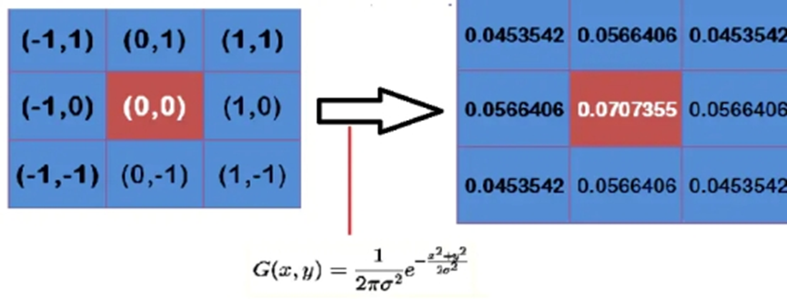

# 现代计算机视觉技术 - Quarto电子书项目

## 📖 项目概述

这是一个基于 [Quarto](https://quarto.org/) 构建的现代计算机视觉技术电子书项目。本书系统地介绍了计算机视觉领域的核心理论、算法实现和实际应用，涵盖从传统图像处理到深度学习的完整技术栈。

**在线阅读地址**: [https://guxinghaoyun.github.io/quarto-web/](https://guxinghaoyun.github.io/quarto-web/)

**GitHub仓库**: [https://github.com/guxinghaoyun/quarto-web](https://github.com/guxinghaoyun/quarto-web)

## 🏗️ 项目结构

```
quarto_book/
├── _quarto.yml              # Quarto项目配置文件
├── index.qmd                # 书籍首页/前言
├── references.qmd           # 参考文献页面
├── references.bib           # BibTeX参考文献数据库
├── cover.png               # 书籍封面图片
├── assets/                 # 静态资源目录
│   ├── cv-book.css         # 自定义样式文件
│   ├── sidebar-accordion.js # 侧边栏手风琴效果脚本
│   └── sidebar-accordion.html # 侧边栏脚本HTML包装
├── chapter03/              # 第三章：图像预处理与增强技术
│   ├── 3.0_概述.qmd
│   ├── 3.1_图像噪声模型与评估.qmd
│   ├── 3.2_空域平滑滤波.qmd
│   ├── 3.3_边缘保留滤波.qmd
│   ├── 3.4_对比度增强与直方图均衡.qmd
│   ├── 3.5_频域增强技术.qmd
│   ├── 3.6_Retinex与色彩校正.qmd
│   ├── 3.7_小结与实践建议.qmd
│   └── chapter3/           # 章节图片资源
├── chapter11/              # 第十一章：三维视觉与点云处理
│   ├── 11.0_概述.qmd
│   ├── 11.1_相机标定与几何.qmd
│   ├── 11.2_立体匹配与深度估计.qmd
│   ├── 11.3_三维重建.qmd
│   ├── 11.4_点云基础与处理.qmd
│   ├── 11.5_PointNet系列网络.qmd
│   ├── 11.6_3D目标检测.qmd
│   ├── 11.7_应用案例分析.qmd
│   └── *_files/            # 各节图片和资源文件
├── _book/                  # 构建输出目录（自动生成）
└── .quarto/               # Quarto缓存目录（自动生成）
```

## 🔧 环境要求

### 必需软件

1. **Quarto** (>= 1.7.0)
   - 官方下载：[https://quarto.org/docs/get-started/](https://quarto.org/docs/get-started/)
   - 或使用包管理器安装

2. **Git** (用于版本控制和部署)
   - macOS: 通常已预装，或使用 `brew install git`
   - Windows: [https://git-scm.com/download/win](https://git-scm.com/download/win)
   - Linux: `sudo apt install git` 或 `sudo yum install git`

3. **现代浏览器** (用于预览)
   - Chrome, Firefox, Safari, Edge 等

### 可选软件

1. **Python** (>= 3.8) - 如需运行代码示例
2. **R** (>= 4.0) - 如需使用R代码块
3. **VS Code** - 推荐的编辑器，有Quarto扩展支持

## 🚀 安装步骤

### 1. 克隆项目

```bash
git clone https://github.com/guxinghaoyun/quarto-web.git
cd quarto-web
```

### 2. 验证Quarto安装

```bash
quarto --version
```

如果未安装Quarto，请访问 [Quarto官网](https://quarto.org/docs/get-started/) 下载安装。

### 3. 检查项目配置

```bash
quarto check
```

这将验证项目配置和依赖是否正确。

## 📚 使用方法

### 本地预览

启动本地开发服务器进行实时预览：

```bash
# 基本预览（默认端口）
quarto preview

# 指定端口和主机
quarto preview --port 4200 --host 0.0.0.0

# 后台运行
quarto preview --no-browser
```

预览服务器启动后，在浏览器中访问显示的地址（通常是 `http://localhost:4200`）。

### 构建网站

生成静态网站文件：

```bash
# 构建到 _book 目录
quarto render

# 清理缓存后重新构建
quarto render --cache-refresh
```

构建完成后，所有网站文件将位于 `_book/` 目录中。

### 部署到GitHub Pages

项目已配置自动部署到GitHub Pages：

```bash
# 一键部署（推荐）
quarto publish gh-pages

# 无交互模式部署
quarto publish gh-pages --no-prompt
```

部署完成后，网站将在几分钟内更新到 GitHub Pages。

## 📋 内容结构

### 当前章节

本项目目前包含以下完整章节：

#### 第三章：图像预处理与增强技术
- **3.0 概述** - 图像预处理的重要性和技术概览
- **3.1 图像噪声模型与评估** - 噪声类型、特征分析和评价指标
- **3.2 空域平滑滤波** - 均值滤波、高斯滤波等基础方法
- **3.3 边缘保留滤波** - 双边滤波、引导滤波等高级技术
- **3.4 对比度增强与直方图均衡** - 提升图像视觉质量的方法
- **3.5 频域增强技术** - 基于傅里叶变换的图像增强
- **3.6 Retinex与色彩校正** - 光照不变性和色彩恢复理论
- **3.7 小结与实践建议** - 技术总结和应用指导

#### 第十一章：三维视觉与点云处理
- **11.0 概述** - 三维视觉技术体系和应用前景
- **11.1 相机标定与几何** - 相机模型、标定方法和几何变换
- **11.2 立体匹配与深度估计** - 双目视觉和深度恢复算法
- **11.3 三维重建** - 从图像到三维模型的重建技术
- **11.4 点云基础与处理** - 点云数据结构和预处理方法
- **11.5 PointNet系列网络** - 深度学习在点云处理中的应用
- **11.6 3D目标检测** - 三维空间中的物体检测技术
- **11.7 应用案例分析** - 实际项目中的技术应用

### 规划章节

项目还规划了以下章节（内容开发中）：
- 第1章：计算机视觉概论
- 第2章：视觉基础与数字图像
- 第4章：传统计算机视觉算法
- 第5章：深度学习基础与卷积神经网络
- 第6章：目标检测技术
- 第7章：语义分割与实例分割
- 第8章：目标追踪与姿态估计
- 第9章：生成式模型与自监督学习
- 第10章：视觉Transformer与多模态学习
- 第12章：视觉系统部署与优化
- 第13章：综合项目实践

## ✨ 自定义功能

### 侧边栏手风琴效果

项目实现了智能的侧边栏折叠功能：
- **自动折叠**: 点击展开一个章节时，其他章节自动收起
- **状态记忆**: 保持用户的导航状态
- **平滑动画**: 提供流畅的用户体验

技术实现：
- `assets/sidebar-accordion.js` - 核心JavaScript逻辑
- `assets/sidebar-accordion.html` - HTML包装文件
- `_quarto.yml` 中的 `collapse-level: 1` 配置

### 优化的中文显示

- **字体优化**: 针对中文阅读优化的字体栈
- **行间距调整**: 适合中文的行高和字间距
- **代码高亮**: GitHub风格的代码语法高亮

### 响应式设计

- **多设备适配**: 支持桌面、平板、手机等设备
- **暗色主题**: 支持明暗主题切换
- **图片优化**: 自适应图片大小和高分辨率显示

## 🛠️ 开发指南

### 添加新章节

1. **创建章节目录**:
```bash
mkdir chapter[XX]
```

2. **创建章节文件**:
```bash
# 在新目录中创建 .qmd 文件
touch chapter[XX]/[XX].0_概述.qmd
touch chapter[XX]/[XX].1_具体内容.qmd
```

3. **更新配置文件**:
编辑 `_quarto.yml`，在 `chapters` 部分添加新章节：

```yaml
- part: "第X章：章节标题"
  chapters:
    - chapter[XX]/[XX].0_概述.qmd
    - chapter[XX]/[XX].1_具体内容.qmd
```

### 修改样式

主要样式文件位于 `assets/cv-book.css`，包含：
- 中文字体优化
- 代码块样式
- 图片展示效果
- 侧边栏样式
- 响应式布局

修改样式后需要重新构建：
```bash
quarto render
```

### 添加图片和资源

1. **章节图片**: 放在对应章节的子目录中
2. **全局资源**: 放在 `assets/` 目录中
3. **引用方式**: 使用相对路径引用

```markdown

```

### 数学公式

项目支持KaTeX数学公式渲染：

```markdown
行内公式：$E = mc^2$

块级公式：
$$
\frac{\partial f}{\partial x} = \lim_{h \to 0} \frac{f(x+h) - f(x)}{h}
$$
```

### 代码块

支持多种编程语言的语法高亮：

```python
import numpy as np
import cv2

# 图像处理示例
img = cv2.imread('image.jpg')
gray = cv2.cvtColor(img, cv2.COLOR_BGR2GRAY)
```

## 🔧 故障排除

### 常见问题

1. **构建失败**
   ```bash
   # 清理缓存重试
   quarto render --cache-refresh

   # 检查配置
   quarto check
   ```

2. **预览无法访问**
   ```bash
   # 检查端口占用
   lsof -i :4200

   # 使用不同端口
   quarto preview --port 4201
   ```

3. **样式不生效**
   - 检查CSS文件路径是否正确
   - 清除浏览器缓存
   - 确认 `_quarto.yml` 中CSS配置正确

4. **部署失败**
   ```bash
   # 检查Git配置
   git remote -v

   # 确认GitHub Pages设置
   # 在仓库设置中启用GitHub Pages
   ```

5. **图片不显示**
   - 检查图片路径是否正确
   - 确认图片文件存在
   - 验证图片格式支持（推荐PNG、JPG）

### 性能优化

1. **构建速度**
   ```yaml
   # 在 _quarto.yml 中设置
   execute:
     freeze: true  # 冻结代码执行结果
     cache: true   # 启用缓存
   ```

2. **图片优化**
   ```yaml
   # 图片设置
   fig-format: retina    # 高分辨率图片
   fig-responsive: true  # 响应式图片
   ```

## 🤝 贡献指南

### 参与方式

1. **内容贡献**
   - 完善现有章节内容
   - 添加新的章节
   - 改进代码示例
   - 修正错误和改进表达

2. **技术贡献**
   - 优化网站性能
   - 改进用户界面
   - 添加新功能
   - 修复Bug

### 贡献流程

1. **Fork项目**
   ```bash
   # 在GitHub上Fork项目
   # 克隆你的Fork
   git clone https://github.com/[your-username]/quarto-web.git
   ```

2. **创建分支**
   ```bash
   git checkout -b feature/your-feature-name
   ```

3. **进行修改**
   - 编辑内容或代码
   - 本地测试确认无误
   - 遵循项目的代码风格

4. **提交更改**
   ```bash
   git add .
   git commit -m "feat: 添加新功能描述"
   git push origin feature/your-feature-name
   ```

5. **创建Pull Request**
   - 在GitHub上创建PR
   - 详细描述你的更改
   - 等待代码审查

### 代码规范

1. **文件命名**
   - 章节文件：`[章节号].[小节号]_标题.qmd`
   - 图片文件：使用描述性名称，避免中文

2. **内容格式**
   - 使用标准Markdown语法
   - 保持一致的标题层级
   - 添加适当的代码注释

3. **提交信息**
   - 使用约定式提交格式
   - `feat:` 新功能
   - `fix:` 修复问题
   - `docs:` 文档更新
   - `style:` 样式调整

## 📄 许可证

本项目采用 MIT 许可证。详见 [LICENSE](LICENSE) 文件。

## 📞 联系方式

- **项目维护者**: AI Assistant & You
- **GitHub Issues**: [提交问题和建议](https://github.com/guxinghaoyun/quarto-web/issues)
- **在线阅读**: [https://guxinghaoyun.github.io/quarto-web/](https://guxinghaoyun.github.io/quarto-web/)

---

**感谢你对现代计算机视觉技术项目的关注和支持！** 🎉
